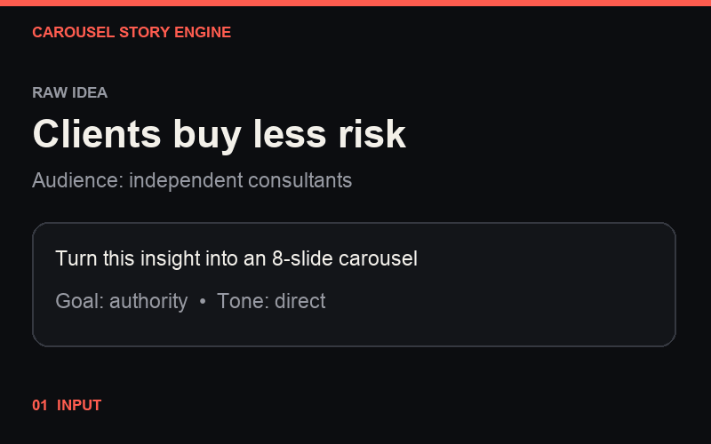
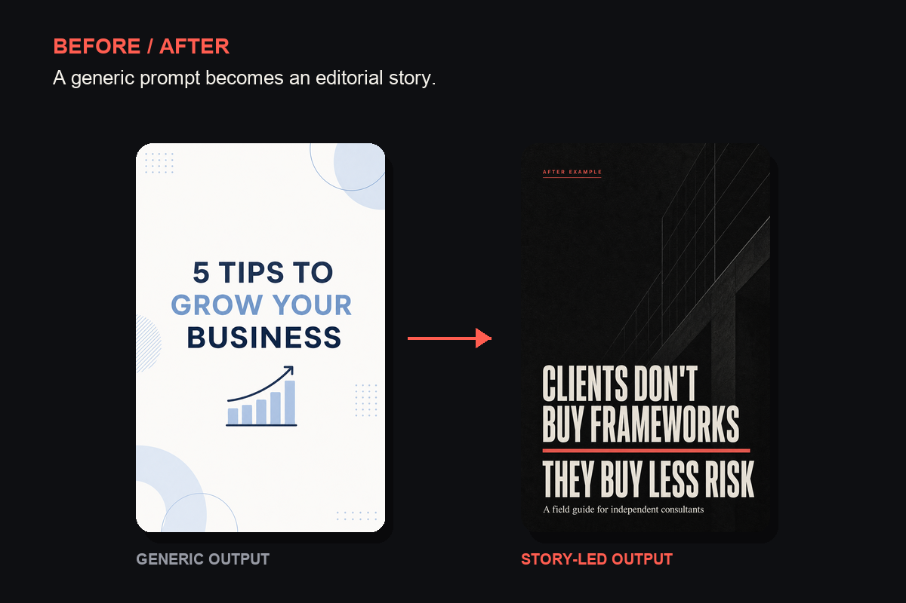
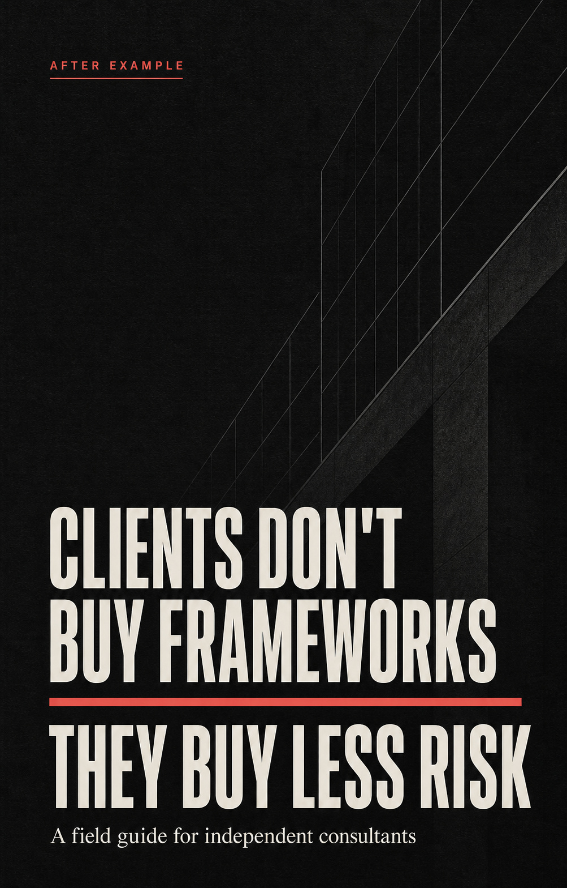

# Carousel Story Engine

**Turn raw expertise into carousels people can finish, trust, and share.**

A portable AI skill for creating evidence-led Instagram and LinkedIn carousels with sharper hooks, real narrative progression, production-ready visual direction, and copy that does not sound assembled by a template.

[](LICENSE)
[](https://github.com/luisroquette/RocketLabs)
[](https://github.com/luisroquette/carousel-story-engine/releases/latest)
[](https://github.com/luisroquette/carousel-story-engine/stargazers)

[Install in 60 seconds](#install-in-60-seconds) · [See a complete output](examples/consulting-risk-carousel.md) · [Read the skill](carousel-story-engine/SKILL.md)

<p align="center">
  
</p>

## Most AI carousels fail after the cover

The first slide makes a large promise. The next six repeat it with different wording. Then a generic CTA asks the reader to save the post.

Carousel Story Engine adds the missing editorial work. It finds a defensible angle, tests competing hooks, builds the argument, separates evidence from opinion, directs every slide visually, and revises the draft before delivery.

The result is a carousel with a reason to keep swiping.

## See the difference

The example below starts with the same topic. One version produces familiar advice. The other gives the reader a specific argument, a mechanism, and a useful next step.



<p align="center">
  
  &nbsp;&nbsp;&nbsp;
  
</p>

<sub>Example artwork generated with GPT Image 2. The layouts are original and are not tied to any third-party brand.</sub>

## One prompt in. A production brief out.

Depending on what you ask for, the skill can deliver:

- a selected angle with ranked hook alternatives;
- slide copy with a clear narrative job for every page;
- reported facts, observed evidence, and unproven theses labeled correctly;
- a caption that adds value instead of summarizing the deck;
- visual components, composition, hierarchy, transitions, and source notes;
- clean JSON for a renderer or automation pipeline;
- optional HTML previews, exported PNGs, and LinkedIn-ready PDFs when the host agent has rendering tools.

Internal reasoning and QA notes stay separate from the publishable copy. Your production team gets a usable brief, not a transcript of the AI thinking aloud.

## A generic prompt vs. the engine

| Generic “write 8 slides” prompt | Carousel Story Engine |
|---|---|
| Accepts the first hook | Compares materially different angles |
| Repeats the premise through the middle | Makes every slide add evidence, mechanism, consequence, or action |
| Presents opinions as facts | Declares the evidence mode before writing |
| Suggests “clean typography” | Specifies component, placement, scale, hierarchy, and accent behavior |
| Copies common AI rhythms | Tests voice, compression, redundancy, and reader skepticism |
| Ends with “save and follow” | Matches the CTA to reach, authority, leads, or sales |

## Install in 60 seconds

### Codex

```bash
git clone https://github.com/luisroquette/carousel-story-engine.git
cp -R carousel-story-engine/carousel-story-engine ~/.codex/skills/
```

Then run:

```text
Use $carousel-story-engine to turn this research into an eight-slide Instagram carousel for independent consultants. The goal is authority. Keep factual claims sourced and return a production brief.
```

### Claude Code, Cursor, and other agents

Copy [`carousel-story-engine/SKILL.md`](carousel-story-engine/SKILL.md) into the skills or project-rules location supported by your agent. You can also attach the file directly as project context.

The skill is plain Markdown. There is no runtime service, account, or vendor lock-in.

## Give it almost anything

Useful inputs include:

- an article or research paper;
- a transcript, interview, or voice-note transcription;
- a case study or customer story;
- a strong opinion that needs a defensible argument;
- an existing carousel that feels generic;
- previous brand posts for vocabulary, rhythm, and point-of-view matching.

If the brief is incomplete, the skill infers low-risk details and asks only for decisions that would materially change the result.

## Example requests

Find the strongest angle in source material:

```text
Use $carousel-story-engine to find three strong angles in this article, compare the hooks, and write the best carousel for LinkedIn.
```

Repair a weak draft:

```text
Use $carousel-story-engine to audit this carousel. Keep the core argument, remove generic AI writing, verify the statistics, and fix the narrative progression.
```

Feed an automated renderer:

```text
Use $carousel-story-engine to create production-ready copy and visual direction in our brand voice. Return the final deck as structured JSON.
```

[Open the complete consulting carousel example →](examples/consulting-risk-carousel.md)

## The editorial pipeline

```text
Source verification
  -> Editorial framing
  -> Hook tournament
  -> Narrative spine
  -> Slide writing
  -> Skeptic and compression tests
  -> Visual direction
  -> Caption and CTA
  -> Silent revision pass
```

Teams can stop after the angle or hook stage for approval before spending time on copy and design. Solo creators can run the full pipeline in one request.

## Built for repeatable quality

The skill does more than enforce a slide template. It adapts the sequence to the material, varies copy density, introduces a useful pattern break, and learns the brand's language from supplied examples.

For factual decks, a claim ledger keeps observations, calculations, theses, hypotheticals, and recommendations separate. Public citation markers remain attached to material claims while full sources stay in the caption or end matter.

Rendered work has its own acceptance gate: native dimensions, loaded fonts, overflow checks, contrast, safe areas, contact-sheet review, and original-resolution inspection. A render is not marked finished merely because the export command succeeded.

When performance data is available, it tracks what matters by hook, topic, format, CTA, and visual treatment. Shares per reach, saves per reach, profile visits, qualified followers, leads, and sales are more useful than a pile of likes.

The repository also includes a [six-case regression suite](evals/cases.md), a public [quality rubric](evals/quality-rubric.md), and the latest [test results](evals/regression-results.md). The tests cover reported facts, observed cases, commercial theses, weak-draft repair, technical changelogs, and cultural stories.

## Keep your own visual identity

Reference accounts can set a quality bar. They should not become a visual costume.

Carousel Story Engine chooses layouts according to the information on each slide: comparisons for competing options, diagrams for mechanisms, timelines for change, data cards for important numbers, and photos when the subject itself is evidence. Brand tokens remain consistent while scale, density, alignment, and components vary.

## Honest answers

### Will this guarantee virality?

No. Distribution changes and audiences behave differently. The skill improves the decisions you can control: topic, evidence, hook, argument, design direction, CTA, and learning.

### Does it require a paid API?

The skill itself calls no service and requires no API key. Your chosen agent, research tools, or image generator may have their own costs.

### Does it clone another creator's style?

No. It can analyze editorial principles and quality patterns, but it explicitly preserves the user's voice and visual identity.

### Can it generate finished images?

Yes, when the host agent has browser, rendering, or image-generation tools. Otherwise it returns copy and a production brief a designer can execute directly.

## Repository structure

```text
carousel-story-engine/
├── assets/                       # before/after and workflow visuals
├── carousel-story-engine/
│   ├── agents/openai.yaml
│   ├── references/
│   │   └── editorial-quality.md  # claim ledger and final quality gate
│   └── SKILL.md                  # the portable skill
├── evals/                        # regression cases and scoring rubric
├── examples/
│   └── consulting-risk-carousel.md
├── LICENSE
└── README.md
```

## License

MIT. Use it in your own projects, adapt it to your workflow, and keep the output recognizably yours.

If this skill saves you from publishing one more generic carousel, [star the repository](https://github.com/luisroquette/carousel-story-engine). It helps other creators find it.

---

<p align="center">
  <strong>Carousel Story Engine is part of <a href="https://github.com/luisroquette/RocketLabs">RocketLabs</a>.</strong><br />
  <sub>Explore more applied AI systems and reusable open-source playbooks.</sub>
</p>
